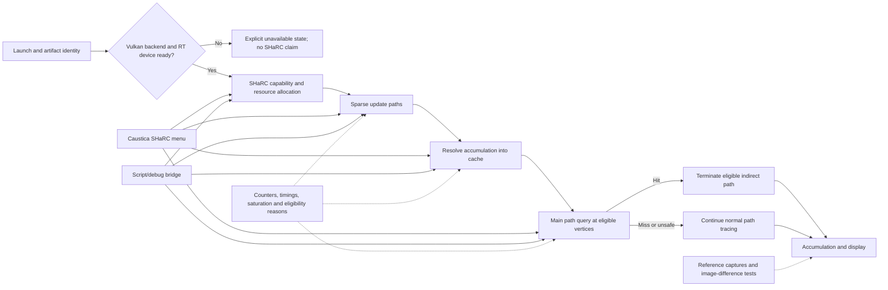

# SHaRC architecture, research findings, and validation plan

Status: planning baseline, 2026-07-16. This document deliberately supersedes the performance
acceptance language in `docs/sharc-runtime-validation.md`; the 6.25 scene-scale result remains a useful
experiment, but it is not accepted because visual correctness was not established and fireflies were
observed afterward.

## Current truth

- The latest failed launch loaded the Caustica mod, but the PrismLauncher `26.2(2)` instance selected
  `preferredGraphicsBackend:"opengl"`. `latest.log` then reported `RT context is not ready` and never
  logged Vulkan device-feature or SHaRC bring-up. This is a backend/preflight failure, not evidence of a
  SHaRC shader failure.
- The last packaged candidate includes the SHaRC options screen and file-backed debug bridge, but that
  candidate has not passed the correctness and runtime gates in this plan.
- The fixed-camera 99 FPS result used scene scale 6.25, 0.25% update paths, and two update bounces. It
  occupied only 2,058 of 2,097,152 entries (0.098%). NVIDIA's static-camera guidance is roughly 10-20%.
  The result therefore indicates extremely coarse reuse and cannot be treated as a quality-safe default.

## System map

The order is a correctness contract: update writes hash/accumulation data, resolve consumes it and
writes resolved data, then query reads it. Resource transitions and UAV barriers must prove that order.

## Reference contract versus the current candidate

NVIDIA SHaRC 1.6.5 recommends starting with one randomly rotated pixel per 5x5 block (4% per frame),
continuing a query path when its segment is shorter than the selected voxel, and using a glossy vertex
only after its effective cone exceeds the voxel resolution:

`2 * rayLength * sqrt(0.5 * a^2 / (1 - a^2))`, where `a = roughness^2`.

Scene scale changes voxel size rather than cache capacity. Lower scene scale produces coarser voxels,
more reuse, and more leakage risk. Radiance is first accumulated in scaled 32-bit unsigned integers and
later packed into float16 resolved values, so both integer overflow and float16 saturation need direct
telemetry. The SDK anti-firefly option adjusts unusually large sample weights using prior confidence; it
is not a general-purpose radiance clamp and cannot prove estimator correctness.

Caustica currently uses material demodulation and separate-emissive mode. Separate emissive is desirable:
the texture-authored emissive signal is evaluated at the current hit and propagated without inventing an
analytic light. The unresolved issue is the cached direct term. `world.rgen.slang` currently combines
diffuse, GGX specular, GGX multiscatter, and thin-surface SSS into `directLighting`, then passes that term
to `SharcUpdateHit`. The SDK divides it by `materialDemodulation`, while Caustica supplies albedo. The
hash key is spatial/normal/level based and does not encode view direction or material identity.

This creates a concrete firefly and bias hypothesis: view-dependent specular can be divided by a very
dark diffuse albedo, accumulated as directionless cache radiance, and multiplied by another receiver's
albedo on query. The correction must be estimator-level, not a brightness clamp. We will evaluate a
cacheable diffuse/SSS component, live specular component, and the SDK's separate authored-emissive
component, while preserving unbiased path throughput and propagation.

## Tuning and observability surface

Every safe runtime control should exist in both the Caustica menu and the script bridge, backed by the
same schema and ranges. Presets may set these controls, but must not hide them.

| Category | Controls or status |
| --- | --- |
| Lifecycle | enabled, reset cache, cold/warm state, reset reason |
| Capacity | cache exponent, entries, actual MiB |
| Spatial reuse | scene scale, minimum segment/voxel ratio |
| Update budget | sample fraction or tile size, update path depth |
| Resolve | accumulation frames, stale frames |
| Numeric range | radiance scale, SDK anti-firefly toggle |
| Query policy | diffuse eligibility, glossy policy, effective-cone threshold |
| Debug | debug view, frame statistics, benchmark capture |
| Read-only identity | backend, RT requested/ready, SHaRC version, artifact SHA-256 |

Compile-time or ABI-affecting values must be visible as read-only status unless deliberate shader
variants are built: 64-bit atomics, material demodulation, separate emissive, propagation depth, normal
hashing, logarithm base, and level bias. Glossy caching stays disabled until the documented cone rule and
its image proof exist; it must not become an unsafe performance toggle.

Required diagnostics:

- update, resolve, query, and baseline trace GPU time;
- update path count/fraction and depth;
- occupancy, insertion failures, collision/probe distance, stale evictions, hit/miss rate, and termination
  depth histogram;
- accumulation input maxima, integer overflow/wrap risk, sample-weight distribution, float16 saturation,
  cached-radiance percentiles, and temporal outlier counts;
- query eligibility reasons: primary, dynamic, short segment, glossy cone, lookup miss, or hit;
- debug views for log cached radiance, confidence/sample count, voxel size/level, saturation/overflow,
  eligibility reason, and contribution class.

## Execution plan

### Gate 0 - boot and identity

Detect the selected graphics backend before entering a world. If it is not Vulkan, show an explicit
Caustica-unavailable message and never report RT output as active. Extend bridge state with backend,
`rtRequested`, RT context readiness, failure latch/reason, SHaRC configured/active, version, and loaded
artifact hash. A test run must show Vulkan feature probing and the exact deployed JAR hash.

### Phase 1 - reference-correct baseline

Start from conservative documented behavior: 4% rotating update coverage, full intended update depth,
segment length at least one voxel, diffuse-only queries, and diagnostic atomics disabled outside a debug
capture. Choose initial scene scale from Minecraft world units and occupancy evidence, not FPS alone.
Keep update, resolve, and query as separately timed stages with explicit barriers.

### Phase 2 - explain fireflies before changing them

Add the numeric and cache-source diagnostics above. Reproduce fireflies with deterministic seeds and
capture the responsible path, cached voxel, sample value, sample weight, material values, and pack range.
Do not add luminance clamps, temporal rejection, or neighborhood filters as a substitute for identifying
the owner. The SDK anti-firefly switch remains available for comparison only.

### Phase 3 - correct the material estimator

Build and compare estimator variants that keep directionless diffuse transport cacheable while evaluating
view-dependent specular live. Preserve authored emissive masks and separate the three torch proofs:
visible emissive surface, rare bright outliers, and environmental illumination. Verify SSS, metals, dark
dielectrics, glass/water, and rough-to-glossy transitions independently. Prefer a Caustica adapter around
the pinned SDK calls over editing NVIDIA headers.

### Phase 4 - complete control surfaces

Make the dedicated SHaRC menu and file bridge expose all safe controls, current effective values, units,
ranges, defaults, restart/reset effects, and live diagnostics. Bridge writes need transaction IDs and
acknowledgements so scripts can prove a setting applied. Add reset, warmup, fixed-duration sample, and
CSV/JSON capture commands; retain UI parity without relying on computer-use automation.

### Phase 5 - deterministic quality/performance matrix

Use fixed camera, exposure, reconstruction settings, seeds, resolution, and world state. For each scene,
capture SHaRC off, cold cache, warm cache, and high-sample/offline reference:

- the user's current cave;
- enclosed authored-emissive torch scene;
- outdoor sun/foliage;
- water and glass;
- mirror, rough metal, and dark dielectric targets;
- emissive surface close to diffuse walls;
- moving entities, block edits, chunk streaming, teleport/rebase, and dimension change.

Only after correctness is stable, sweep scene scale, update rate, update depth, accumulation, stale lifetime,
and capacity. Record median, mean, 1% low, GPU stage times, occupancy, hit rate, and image/temporal error.
GPU power is supporting evidence of utilization, not a standalone success metric.

### Acceptance gates

1. Correct Vulkan backend, RT context, SHaRC capability, and exact artifact identity.
2. Clean build, shader-contract tests, and zero validation/VUID/device-loss errors.
3. No unexplained overflow, float16 saturation, or temporal cache outliers in a long deterministic run.
4. Image-difference thresholds versus the reference, plus manual review of temporal stability and all
   material classes. No fix is accepted solely because it hides bright pixels.
5. All three torch proof points pass without analytic lights or replacement emissive masks.
6. Warm SHaRC improves median/mean and 1% low over SHaRC-off in the current cave, with GPU-stage evidence,
   and has no unacceptable regression across the scene matrix.
7. A 15-30 minute travel/edit/dimension soak completes without growing allocation, invalid reset loops,
   artifacts, validation errors, or crashes.

Only after every gate passes should tuned defaults be selected and the candidate be called implemented
end to end.
